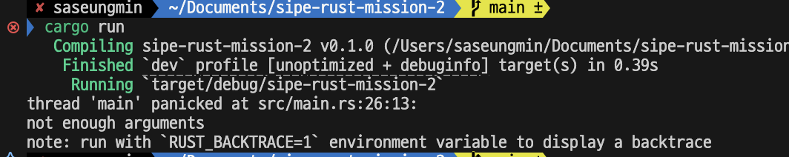
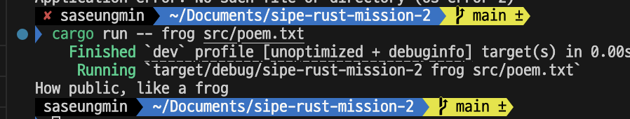
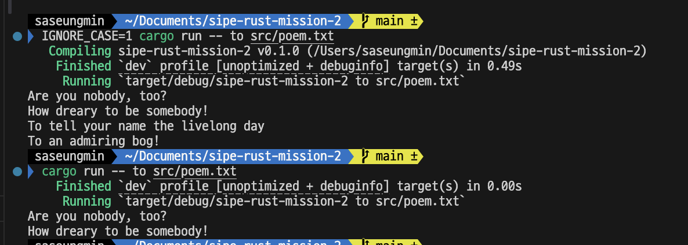
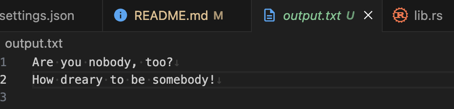

# mini grep 만들기

- github repository : https://github.com/saseungmin/sipe-rust-mission-2


인수의 값 읽을때에는 `std::env::args`를 사용   
하지만, 유니코드가 들어있다면 패닉을 일으킴. 유효하지 않는 유니코드를 받으려면 std::env::args_os를 사용해함.   

```bash
cargo run -- needle haystack
    Finished `dev` profile [unoptimized + debuginfo] target(s) in 0.00s
    Running `target/debug/sipe-rust-mission-2 needle haystack`
[src/main.rs:7:5] args = [
    "target/debug/sipe-rust-mission-2",
    "needle",
    "haystack",
]
```

벡터의 첫 번째 값이 `"target/debug/sipe-rust-mission-2"`, 즉 이 바이너리 파일의 이름   

### 관심사 분리
- 기존의 코드에는 책임이 너무 많았음.

#### 인수 파서 추출

```rust
fn main() {
    let args: Vec<String> = env::args().collect();

    let (query, file_path) = parse_config(&args);

    // --생략--
}

fn parse_config(args: &[String]) -> (&str, &str) {
    let query = &args[1];
    let file_path = &args[2];

    (query, file_path)
}
```

#### 설정 값 묶기

```rust
struct Config {
    query: String,
    file_path: String,
}

fn parse_config(args: &[String]) -> Config {
    let query = args[1].clone();
    let file_path = args[2].clone();

    Config { query, file_path }
}
```

String 데이터를 관리하는 방법 중 가장 쉬운 방법은 (다소 비효율적이지만) 그 값에서 `clone` 메서드를 호출하는 것.   
이는 데이터의 전체 복사본을 만들어 Config 인스턴스가 소유할 수 있게 해주는데, 이는 문자열 데이터에 대한 참조자를 저장하는 것에 비해 더 많은 시간과 메모리를 소비.   
그러나 값의 복제는 참조자의 라이프타임을 관리할 필요가 없어지기 때문에 코드를 매우 직관적으로 만들어 주기도 하므로, 이러한 환경에서 약간의 성능을 포기하고 단순함을 얻는 것은 가치 있는 절충안이다.   

#### Config를 위한 생성자 만들기

```rust
fn main() {
    let args: Vec<String> = env::args().collect();

    let config = Config::new(&args);

    // --생략--
}

// --생략--

impl Config {
    fn new(args: &[String]) -> Config {
        let query = args[1].clone();
        let file_path = args[2].clone();

        Config { query, file_path }
    }
}
```

#### 에러 메시지 개선

- 인자가 3개 미만이면 에러 메시지 노출

```rust
// --생략--
fn new(args: &[String]) -> Config {
    if args.len() < 3 {
        panic!("not enough arguments");
    }
// --생략--
```



#### panic! 호출 대신 Result 반환하기

```rust
// main()
let config = Config::build(&args).unwrap_or_else(|err| {
    println!("Problem parsing arguments: {err}");
    process::exit(1)
});

impl Config {
    // 성공한 경우 Config를, 에러가 난 경우 &'static str을 갖는 Result를 반환
    fn build(args: &[String]) -> Result<Config, &'static str> {
        if args.len() < 3 {
            return Err("not enough arguments");
        }

        let query = args[1].clone();
        let file_path = args[2].clone();

        Ok(Config { query, file_path })
    }
}
```


- process::exit 함수는 프로그램을 즉시 멈추고 넘겨진 숫자를 종료 상태 코드로서 반환되어 추가 출력문이 안보이게됌.


#### main으로부터 로직 추출

```rust
fn run(config: Config) {
    let contents =
        fs::read_to_string(config.file_path).expect("Should have been able to read the file");

    println!("With text:\n{contents}");
}
```


#### run 함수로부터 에러 반환하기

```rust
// 트레이트 객체 Box<dyn Error>
fn run(config: Config) -> Result<(), Box<dyn Error>> {
    let contents = fs::read_to_string(config.file_path)?;

    println!("With text:\n{contents}");

    Ok(())
}
```

- `Ok(())` 문법은 `run`을 호출하여 부작용에 대해서만 처리하겠다는 것을 가리키는 자연스러운 방식. 즉 반환 값이 필요 없는 경우.


#### main에서 run으로부터 반환된 에러 처리하기

```rust
fn main() {
    // --생략--

    println!("Searching for {}", config.query);
    println!("In file {}", config.file_path);

    if let Err(e) = run(config) {
        println!("Application error: {e}");
        process::exit(1);
    }
}
```

- `run`이 성공한 경우 `()`를 반환하기 때문에 에러를 찾는 것만 신경 쓰면 되므로, `()`가 들어있을 값을 반환하기 위해 `unwrap_or_else`를 쓸 필요는 없음.

#### 라이브러리 크레이트로 코드 쪼개기

```rust
// src/lib.rs
use std::error::Error;
use std::fs;

pub struct Config {
    pub query: String,
    pub file_path: String,
}

impl Config {
    pub fn build(args: &[String]) -> Result<Config, &'static str> {
        // --생략--
    }
}

pub fn run(config: Config) -> Result<(), Box<dyn Error>> {
    // --생략--
}
```

### 테스트 주도 개발로 라이브러리 기능 개발하기

#### run 함수에서 search 함수 사용하기

```rust
pub fn run(config: Config) -> Result<(), Box<dyn Error>> {
    let contents = fs::read_to_string(config.file_path)?;

    for line in search(&config.query, &contents) {
        println!("{line}");
    }

    Ok(())
}
```



### 환경 변수 사용하기
- 환경 변수 사용을 위한 함수는 표준 라이브러리의 env 모듈
- 이 환경 변수의 값에 대해서는 고려하지 않고 그저 값이 설정되어 있는지 아닌지만 고려하므로, 여기서는 `unwrap`이나 `expect` 혹은 `Result`에서 사용했던 다른 메서드들 대신 `is_ok`를 사용




### 표준 출력 대신 표준 에러로 에러 메시지 작성하기
에러 출력시

```bash
cargo run > output.txt
```

main.rs 수정

```rust
let config = Config::build(&args).unwrap_or_else(|err| {
    eprintln!("Problem parsing arguments: {err}");
    process::exit(1)
});

if let Err(e) = run(config) {
    eprintln!("Application error: {e}");
    process::exit(1);
}
```

표준 에러 스트림으로 출력하는 `eprintln!` 매크로를 제공   

```bash
cargo run -- to poem.txt > output.txt
```

터미널에는 아무런 출력을 볼 수 없고, `output.txt`에는 결과물이 담겨 있음   


