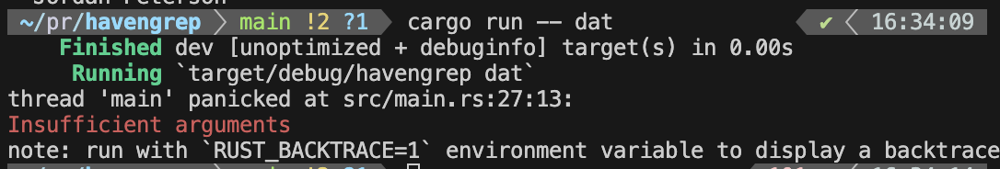
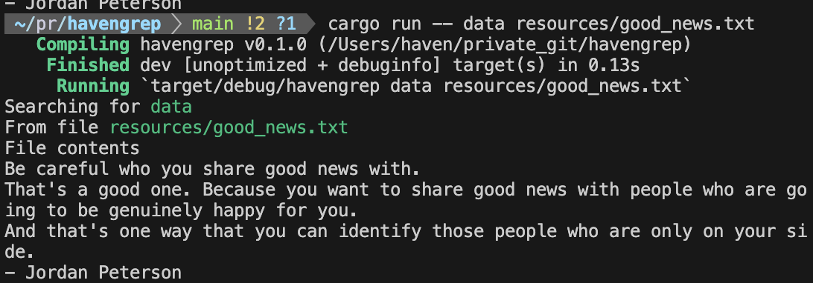
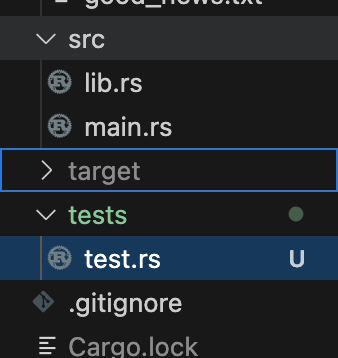
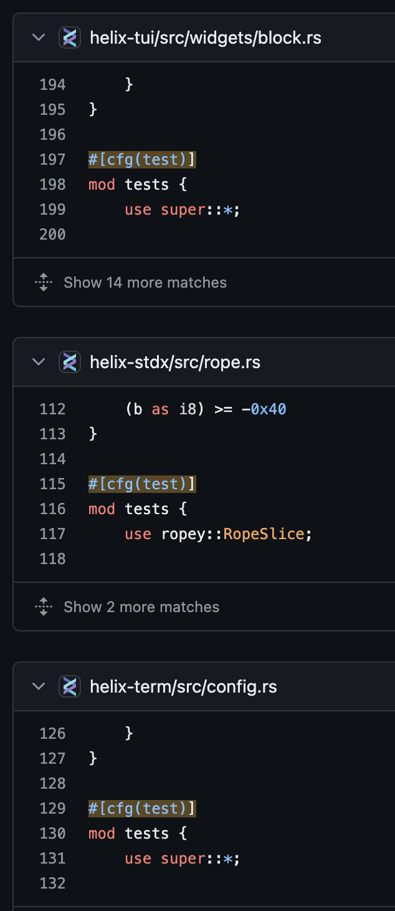
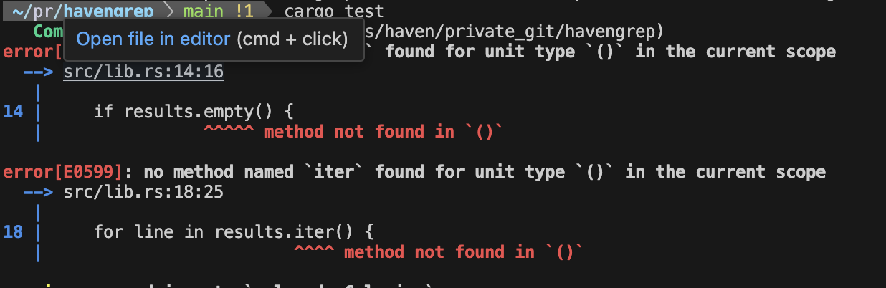

# havengrep

## 20240607

드디어 회사 일을 모두 끝내고 샌드위치 휴일이어서 휴가까지 쓴 금요일에 프로젝트 작업을 착수하였다.

- [havengrep](https://github.com/raacker/havengrep)
- Inspired by [ripgrep](https://github.com/BurntSushi/ripgrep)
- References [Chapter 12 - I/O Command line Projects](https://doc.rust-kr.org/ch12-00-an-io-project.html)

#### std::env에서 프로그램 실행환경 관리 쌉가능

Rust가 최신 언어라는 점은 꽤나 귀찮고 불편한 것들이 자체적으로 구현되어 있다는 점일 듯 싶다. C나 C++만 하더라도 다양한 환경에서 커버 가능하고 쉽게 관리할 수 있는 기능들은 대부분 라이브러리를 통해서만 가능하다. Rust는 언어 자체에서 이를 지원하고 있으니 꽤 편리하다고 볼 수 있는 점.

```rust
fn main() {
    let args: Vec<String> = std::env::args().collect();
}
```

한가지 특이한 점은 으레 main 함수에서 매개변수로 받아야 하는 편인데 (int main(int argc, void\* argv){} 등의 녀석들) rust에서는 이를 다르게 받아서 사용하고 있다.

문서에서는 시를 예제로 들었는데, 나는 최근에 제법 감명깊었던 내용을 파일로 남겨봤다.

> Be careful who you share good news with.
> That's a good one. Because you want to share good news with people who are going to be genuinely happy for you.
> And that's one way that you can identify those people who are only on your side.
>
> \*Jordan Peterson

#### Terminal에 색 입히기

역시 색칠공부가 짱.

ripgrep을 쓰면서도 좋았던 게, 가장 핵심적일 정보들에 visual annotation을 사용해서 한 눈에 바로 알아볼 수 있도록 했다는 점인데, 바로 적용해봤다.

간단하게 [colored](https://docs.rs/colored/latest/colored/index.html)를 cargo로 설치해준 뒤, panic! 메세지와 정상 출력 메세지들에 색을 입혀줬다.

Cargo.toml에는 아래처럼 현재 최신인 2.1.0 버전이 설치된다.

```rust
[dependencies]
colored = "2.1.0"
```

그리고 참 편리하게도 string literal에 바로 적용해줄 수 있다.

```rust
use colored::Colorize;

panic!("{}", "Insufficient arguments".red());
```




## 20240608

#### 에러의 처리

오랜만에 봐서 생각나지 않았는데 굳이 Ok일 때 리턴할 게 없다면 그냥 `if let`을 사용하는 게 조금 더 코드를 이해하기 쉬운 것 같다.

아래의 두 if 문은 동일하다.

```rust
if let Err(e) = grep(input) {
    println!("Problem reading the file: {}", e.to_string().red());
    process::exit(1);
}

grep(input).unwrap_or_else(|e| {
    println!("Problem reading the file: {}", e.to_string().red());
    process::exit(1);
});
```

#### Testing

- 별도의 테스트 파일을 작성하려면 `tests`라는 폴더 아래에 넣어야 한다.

  

  - 별도의 tests 폴더에 넣는 것은 (공식 문서에서 얘기하는 바에 따르면) 보통 integration test를 위한 것이다.
    - [ripgrep - tests/regression.rs](https://github.com/BurntSushi/ripgrep/blob/master/tests/regression.rs#L5)

- 각각의 함수 또는 feature에 대한 유닛 테스트 코드들은 해당 소스파일에 같이 넣는다.

  - [grep-printer - json.rs](https://github.com/BurntSushi/ripgrep/blob/master/crates/printer/src/json.rs#L871)
  - 명확한 룰이 있다고 보긴 어려워 보이는게, repository마다 가끔 뒤죽박죽 인 것 같기도 하고 소스 코드 자체가 길어지다보면 문제가 생길 것 같기도 하다. 그런데 scope를 제한 하는 것이 언어의 기본 성격이라서 그런가? 많은 repository가 이 룰을 따르고 있는 중.

  

## 20240618

#### 세미콜론 지옥

아래와 같은 코드 때문에 왜 안되는 것인지 찾다가 생각보다 애먹었다...

```rust
let results = if input.ignore_case {
    search_case_insensitive(&input.query, &file_contents);
} else {
    search(&input.query, &file_contents);
};
```



지금와서 보면 너무 당연한데 세미콜론으로 이런 일이 벌어지다니... rust에서는 세미콜론을 생략하여 바로 return의 형태로 만드는 문법이라는 것을 망각했다. `let = if` 문에서도 동일하게 세미콜론을 붙이면 단순 실행이다 ㅠ

정확한 코드는 세미콜론을 떼서 `results`에 Vec<&str>을 넣는 것.

```rust
let results = if input.ignore_case {
    search_case_insensitive(&input.query, &file_contents)
} else {
    search(&input.query, &file_contents)
};
```

## 20240702

#### Iterator를 직접 넘겨서 복사하지 않고도 값의 접근만 가능하도록 하기

기본적으로 `env::args()` 의 반환타입은 Iterator이다. 13장에 오기 전까지는 clone()을 가지고 복사해서 사용하도록 예제코드가 구성되어 있었는데 반복자를 사용하면서 이를 피하고, Input option을 바로 만들어낼 수 있도록 한다.

아래는 iterator를 쓰기 전의 코드이고, collect를 통해 매개변수를 벡터로 바꾼다. 그리고 reference로 넘긴 뒤 clone을 하도록 한다.

```rust
let args: Vec<String> = env::args().collect();
let input = Input::build(&args).unwrap_or_else(|err| {
}
```

이제 `env::args()`를 직접 매개변수로 넘긴 뒤, trait으로 정하여 확장성을 높인다. `impl Iterator<Item = String>` 이라는 문법이 꽤나 예쁜데, Iterator trait을 구현하고 element가 string인 모든 매개변수는 받을 수 있다는 것을 정말 깔끔하게 표현하기 때문이다. 뭐... 다른 언어에도 비슷하게 있겠지만 편애를 조금 해보겠다.

```rust
let input = Input::build(env::args()).unwrap_or_else(|err| {
}

pub fn build(
        mut args: impl Iterator<Item = String>,
    ) -> Result<Input, &'static str> {
}
```

또한 search 함수도 아주 간결하게 바꾸는데 Java의 Stream도 비슷하게 구현되어 있을 것 같다.

```rust
let mut results = Vec::new();

for line in contents.lines() {
    if line.contains(query) {
        results.push(line);
    }
}

results
```

요게 이렇게 바뀌었습니다.

```rust
contents
    .lines()
    .filter(|line| line.contains(query))
    .collect()
```

#### Clap

위에 했던 모든 것들이 사실상 clap을 만들어보는 과정이었다. Clap 하나로 모두 정리되었다.

clap::Parser를 import 한 다음 struct 자체를 derive 시키면 `parse` 함수를 사용할 수 있고, 자연스럽게 CLI 파라미터들을 바로 사용할 수 있게된다. 

```rust
use clap::Parser;

#[derive(Parser)]
pub struct Input {
    query: String,
    file_path: std::path::PathBuf,

    #[arg(short = 's', long = "case-sensitive", default_value = "true")]
    case_sensitive: bool,
}
```

그렇게 한 뒤 바로 parse하면 모든 값에 대한 파싱이 끝난 struct를 얻게된다.

```rust
let input = Input::parse();
```