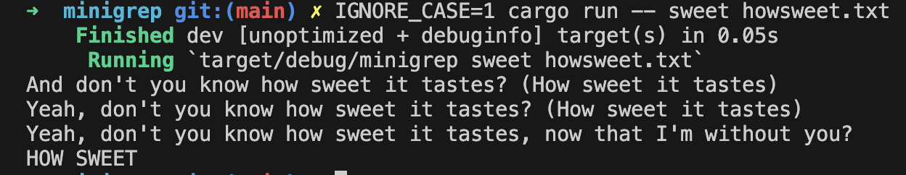
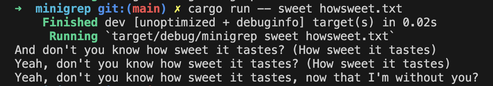
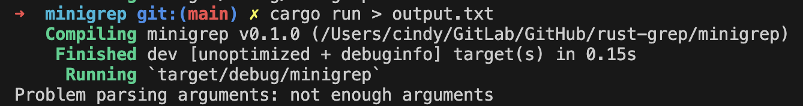
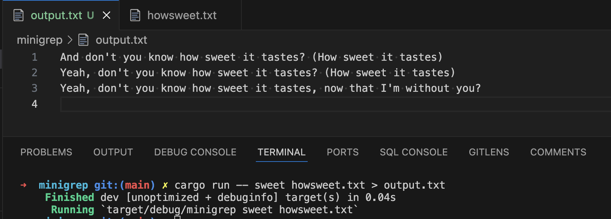

# minigrep
[hy57in repository 링크](https://github.com/hy57in/rust-grep)

## 진행 경과

### 24.06.08
- 12.1. 커맨드 라인 인수 받기 (✅)
- 12.2. 파일 읽기 (✅)
- 12.3. 모듈성과 에러 처리 향상을 위한 리팩터링 (🔼)

### 24.06.12
- 12.3. 모듈성과 에러 처리 향상을 위한 리팩터링 (✅)
- 12.4. 테스트 주도 개발로 라이브러리 기능 개발하기 (✅)

### 24.06.19
- 12.5. 환경 변수 사용하기 (✅)

`IGNORE_CASE` 환경 변수를 통해 사용자가 켤 수 있는 대소문자를 구분하지 않는 검색 옵션이다. 이 기능을 커맨드 라인 옵션으로 만들어서 필요한 경우 사용자가 매번 입력하도록 요구할 수도 있겠으나, 환경 변수로 만듦으로써 사용자는 이 환경 변수를 한 번만 설정하고 난 다음 그 터미널 세션 동안에는 모든 검색을 대소문자 구분 없이 할 수 있게 된다.

`howsweet.txt` 안에 `sweet` 이라는 단어가 있는 라인을 대소문자 구분 없이 노출한다.

`IGNORE_CASE` 환경 변수를 설정하지 않으면 대소문자 구분이 된다.

### 24.07.03
- 12.6. 표준 출력 대신 표준 에러로 에러 메시지 작성하기 (✅)

`println!` 을 표준 에러 스트림으로 출력하는 `eprintln!` 매크로로 바꾸어 성공적인 출력에 대해서는 표준 출력을, 에러 출력에 대해서는 표준 에러를 적절히 사용하도록 개선

표준 에러로 에러 출력

표준 출력을 파일로 리디렉션 시킴
