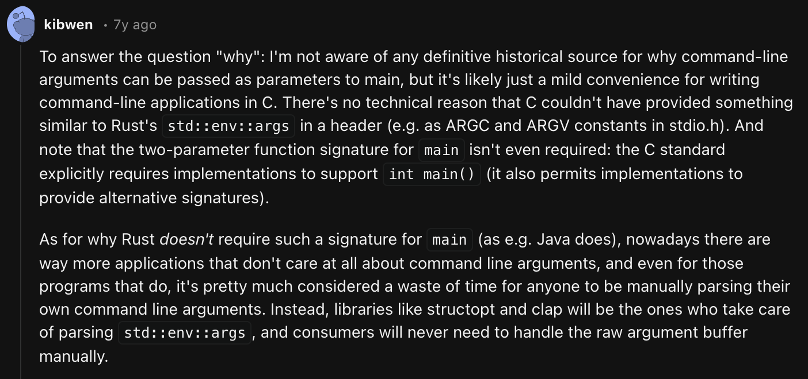
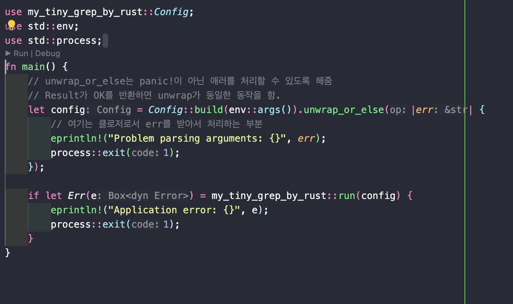
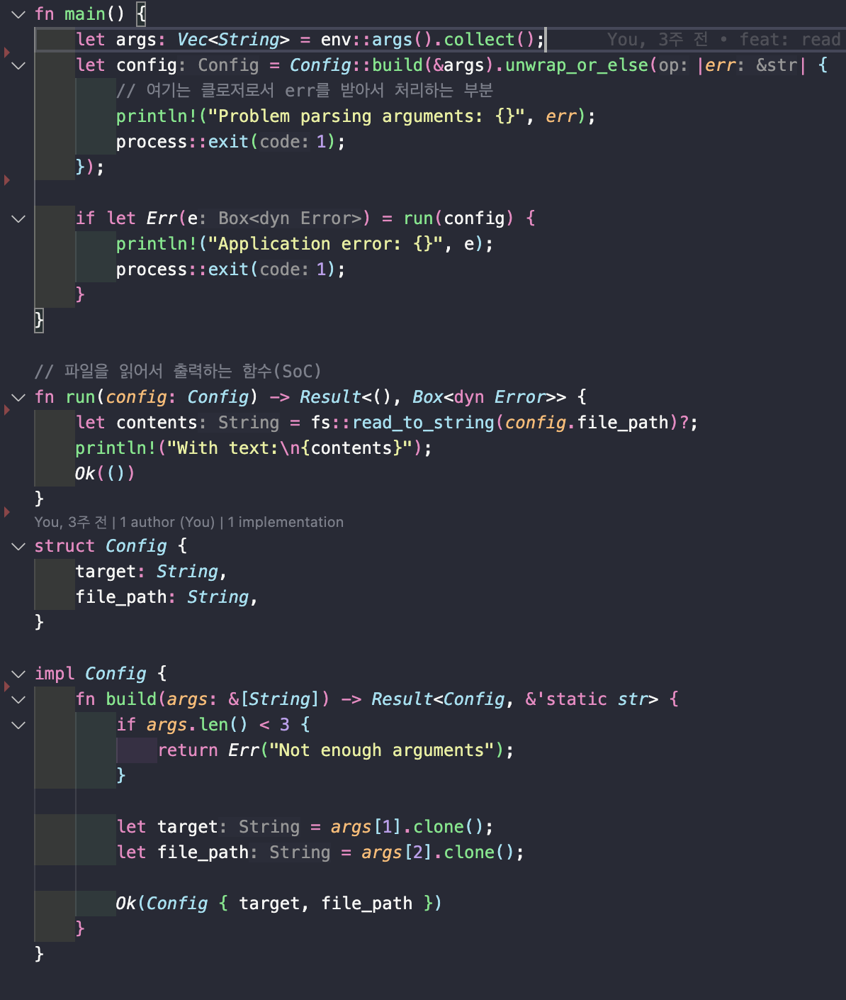
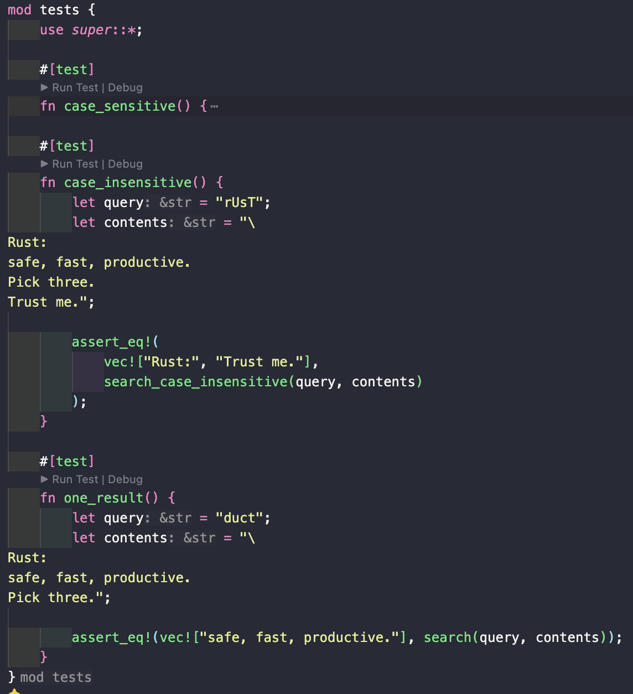
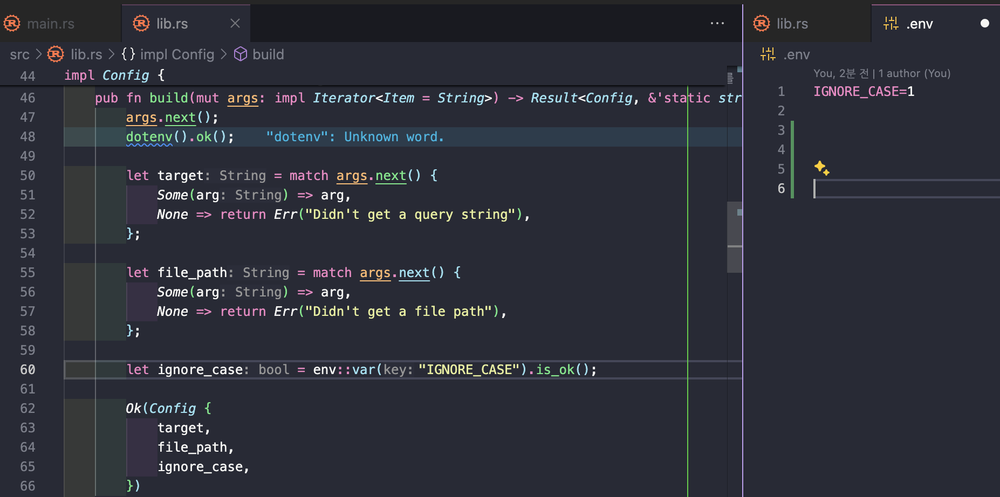
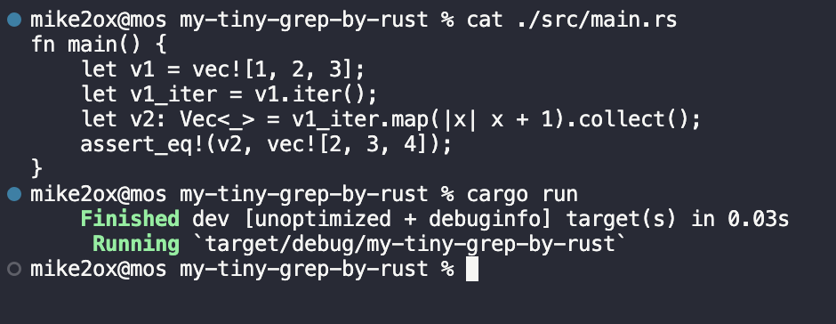
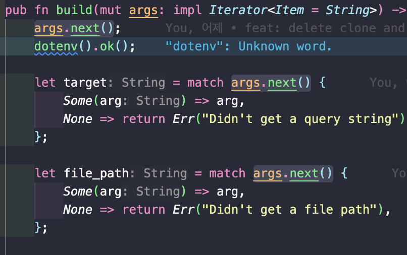
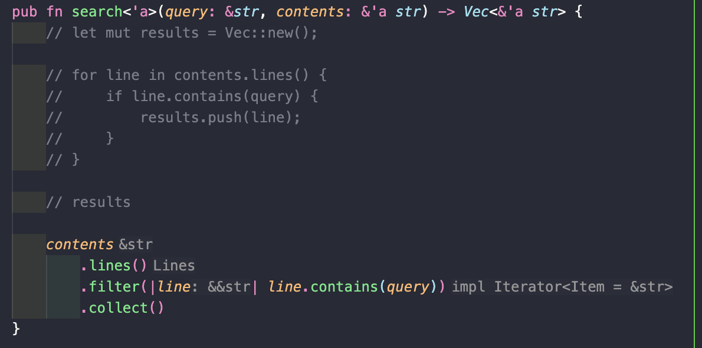

# Project Repo

- [my-tiny-grep-by-rust](https://github.com/mike2ox/my-tiny-grep-by-rust)

## Demo

[](https://youtu.be/ZY4ICyNF9QE)

> **result 폴더 안에 데모 원본 영상이 있습니다!**

## Process

### 24.06.05

- 여행으로 인해 진행 X

### 24.06.12

- 12.1. 커맨드 라인 인수 받기 ✅
- 12.2. 파일 읽기 ✅
- 12.3. 모듈성과 에러 처리 향상을 위한 리팩터링 ✅

### 24.06.19

- 진행 X
- 휴일에 온라인 모각작을 진행할 예정

### 24.06.26

- 12.4. 테스트 주도 개발 ✅
- 12.5. 환경 변수를 이용한 설정 ✅

### 24.06.30

- 12.6. 표준 출력 대신 표준 에러로 에러 메시지 작성하기 ✅
- 13.1. 클로저: 자신의 환경을 캡처하는 익명 함수 ✅
- 13.2. 반복자로 일련의 아이템들 처리하기 ✅
- 13.3. I/O 프로젝트 개선하기 ✅

### 24.07.03

- 13.4. 성능 비교하기: 루프 vs. 반복자 ✅

## Memo & Experiment

### 12.1 커맨드 라인 인수 받기

- `std::env::args`를 이용하여 커맨드 라인에서 인수를 가져올 수 있음

  ```rust
  let args: Vec<String> = env::args().collect();
  dbg!(&args); // ["target/debug/my-tiny-grep", "foo", "poem.txt"]
  ```

  > C/C++에서 main 함수의 인수를 받는 것과 유사하다. 단, Rust는 `env::args`를 통해 인수를 가져온다.
  > 원격 스터디에서 공유받은 자료에서는 현대 애플리케이션에서는 커맨드 라인에서 인수를 받는데 신경쓰지 않는 경우가 많고 그나마도 커맨드 라인을 통해 개발자가 수동 파싱하는 경우는 시간낭비라고 한다. 그래서 Rust는 `clap`이라는 라이브러리를 사용하여 커맨드 라인 인수를 처리하는 것을 추천한다. (토크나이징을 하는 과정에서 `clap`을 사용하면 좋다고 함(Thanks to 헌겸!))
  > 

  > > 최근 사내 AI 라이브러리 및 채팅 시스템 구축을 위해 러스트 스터디를 시작하는데 이 부분에 대한 답변을 들었는데 추후 정리해서 공유할 계획.

### 12.2 파일 읽기

- std::fs::read_to_string을 이용하여 파일을 읽을 수 있음

  ```rust
  let contents = fs::read_to_string(&config.filename)
      .expect("Something went wrong reading the file");
  ```

  > 파일을 읽을 때는 `expect`를 이용하여 에러 처리를 할 수 있다.
  > `expect` 대신 `unwrap_or_else`를 사용하면 좀 더 세밀한 에러 처리를 할 수 있다.

  ```rust
  let contents = fs::read_to_string(&config.filename)
      .unwrap_or_else(|err| {
          println!("Something went wrong reading the file: {}", err);
          process::exit(1);
      });
  ```

### 12.3 모듈성과 에러 처리 향상을 위한 리팩터링

- 프로그램의 구조적, 잠재적 에러처리 방식과 유지보수를 위한 코드 구조화에 대한 고민
  - 역활에 따라 코드를 분리하는 것이 좋다.(1)
  - 의미있는 변수들끼리 구조체로 묶어서 관리하는 것이 좋다.(2)
  - 에러 케이스별로 에러 메세지를 출력하는 것이 좋다.(3)
  - 에러 처리의 유지보수를 위해 한 곳에서 관리하는 것이 좋다.(4)

> 리팩토링 기준은 여타 언어와 동일했다.

- before
- 
- after
- 

> 추가로 세부적인 에러 처리를 위해 기존에 `expect`를 사용하던 부분을 `unwrap_or_else`로 변경하였다.
> 여기서 build의 반환타입이 `Result`인데 라이프타임을 static으로 지정하여 프로그램이 종료될 때까지 유지되도록 하였다.

### 12.4 테스트 주도 개발

- 테스트 코드를 작성할 때는 `#[cfg(test)]`를 사용하여 테스트 코드임을 명시한다.

  ```rust
  #[cfg(test)]
  mod tests {
      use super::*;

      #[test]
      fn one_result() {
          let query = "duct";
          let contents = "\
  Rust:
  safe, fast, productive.
  Pick three.";
          assert_eq!(
              vec!["safe, fast, productive."],
              search(query, contents)
          );
      }
  }
  ```

  > 테스트 코드를 작성할 때는 `#[cfg(test)]`를 사용하여 테스트 코드임을 명시한다.
  > 테스트 코드는 `mod tests`로 시작하며 `#[test]`를 사용하여 테스트 함수임을 명시한다.
  > 테스트 함수는 `assert_eq!`를 사용하여 예상 결과와 실제 결과를 비교한다.

  > 해당 프로젝트에서 안내해주는 테스트 코드

- 

> 🤔 기존 웹 개발에서 TDD를 제대로 활용하면서 개발을 할 수 없었지만, Rust같은 경우 개발 사이클이 다른 언어들에 비해 느리면서 견고한 프로그램을 짤 때 빛을 발하기에 Rust 프로젝트를 하면서 TDD를 제대로 접목해볼 수 있지 않을가 싶다 (실제로 Rust의 그러한 특징들 때문에 9월에는 채팅 시스템 구축과 기존 사내 Rust 라이브러리 유지보수를 하게됨😇)

### 12.5 환경 변수를 이용한 설정

- 환경 변수를 이용하여 프로그램의 설정을 변경할 수 있다.

  ```rust
  let query = env::var("QUERY").unwrap();
  let filename = env::var("FILENAME").unwrap();
  ```

  > 환경 변수를 사용할 때는 `env::var`를 이용하여 가져올 수 있다.
  > 환경 변수가 없을 경우 `unwrap`을 사용하면 프로그램이 종료되므로 `expect`를 사용하여 에러 처리를 할 수 있다.

### 12.6 표준 출력 대신 표준 에러로 에러 메시지 작성하기

- 환경 변수를 이용하여 프로그램의 설정을 변경할 수 있다.

  ```shell
  $ QUERY=foo FILENAME=poem.txt cargo run -- {찾고자한 문자열} {목표 파일}
  ```

  > 이 방식은 cargo로 실행하기 전에 환경변수를 설정해야 하지만 dotenv를 사용해 .env 파일을 만들어 환경변수를 설정할 수 있다.

  - 

### 13.1. 클로저: 자신의 환경을 캡처하는 익명 함수

- 클로저는 함수와 다르게 자신의 환경을 캡처할 수 있다.

  ```rust
  let equal_to_x = |z| z == x;
  let y = 4;
  assert!(equal_to_x(y));
  ```

  > 클로저는 함수와 다르게 자신의 환경을 캡처할 수 있다.
  > 클로저는 `|z| z == x`와 같이 선언하며 `z`는 클로저의 인자이다.
  > 클로저는 `equal_to_x(y)`와 같이 호출할 수 있다.

  > > 자바스크립트의 클로저와 비슷한 개념으로 보이기에 rust에서의 클로저 사용 방식만 체크함

### 13.2. 반복자로 일련의 아이템들 처리하기

- 반복자는 `iter`와 `into_iter`로 생성할 수 있다.
- 

- 모든 반복자는 `Iterator` 트레이트를 구현하고 `next` 메서드를 가지고 있다.

```rust
pub trait Iterator {
    type Item;

    fn next(&mut self) -> Option<Self::Item>;

}
```

> type Item과 Self::Item은 연관타입이라고 하며 트레이트를 구현하는 타입에 따라 다르게 정의된다.

> > 해당 부분의 동작은 기존 언어들의 Iterator와 비슷하다고 판단해 별도의 실험을 하진 않음

### 13.3. I/O 프로젝트 개선하기

- 해당 파트에서 적용해본 개선점은 2가지
  - `clone`대신 `Iterator`를 활용
  - 
  - `filter`를 사용해 좀 더 함수형 프로그래밍 스타일로 변경
  - 

## 궁금한 점

- main 함수의 입력부에는 별도의 변수가 없는건가? (ex. c 언어의 argc, argv)
  => [참고하자](https://www.reddit.com/r/rust/comments/7ud3mh/beginner_question_main_function_arguments)

- clone을 남발하면 결국 기존 C계열의 메모리 관리와 다를바 없지 않을까? 그러고도 Rust를 사용할 이유가 있을까?
  => 너무 빡빡하게 잡는 것도 잘못된 것 같다. 실제로 `unsafe`를 만들어 놓은 것도 그런 의도가 아닐까?
