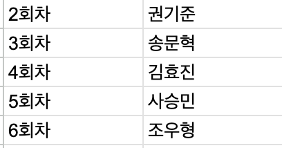

# Seminar 1차 - 20240529

## Rust팀 주요 일정

- 6월 28일 금요일: 쫑파티
- 7월 3일 수요일: 온라인 데모데이

## 세미나 진행 방식

- 서기 당번을 정해서 각 주에 온라인 (또는 오프라인) 회의 동안 나왔던 내용들을 markdown 파일로 기록하자.
- 영상이나 음성 녹음 보다는 이게 더 좋은 기록 자료가 될 것 같음.
- 

## 개발 진행 방식

- 특별한 마감기한 없이 진행. 각자의 스케쥴이 현생에 의해 심히 영향 받는 것이 1회차 스터디 동안의 경험이니 셀프 프로젝트 매니지먼트 방식을 차용하자.
- 이번에는 스터디를 하는 것이 아니기 때문에 **프로젝트를 기간안에 완수해야 한다는 점**을 명확하게 하자. 반드시 binary 형태의 프로그램 결과물이 나와야한다.
- 각자의 개인 repository를 만들고 그 안에서 코드 작업을 한다.
  - 2-2_rust에는 각자의 이름으로 된 폴더를 만든다.
  - 개인의 폴더안에 README.md를 만들고 작업 과정을 기록으로 남긴다. 이를 모임 시간에 공유한다.
  - 마지막 결과물을 해당 폴더에 빌드 결과물로 첨부하고 6주차에 demo를 진행한다.
- 참고로 이번주 주말까지 [12.2](https://doc.rust-kr.org/ch12-02-reading-a-file.html) 구현을 마쳐놓아야 스케쥴 관리가 될 것으로 생각된다.

## 쫑파티

- 1, 2회차까지 같이 동고동락했던 만큼 마지막 주차에 쫑파티를 하자.
- 투표결과 6월 28일 금요일 저녁 퇴근 시간으로 결정 (6월 26일 온라인 모임은 취소)
